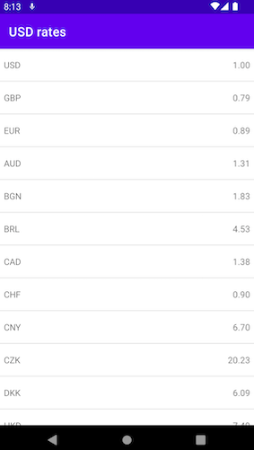

## Rates app

Your task is to create a single screen app that displays a list of exchange rates for USD currency. 
Final design for the screen: 
### Requirements
- Update rates each 1 second,
- Fix existing UI and propose UI performance improvements,
- Provide performance and stability updates to RatesCacheImpl,
- Add a test for the logic of interacting with service.

### Extra requirements
- Integrate RatesCacheImpl into the app.

### Notes
The overall focus points are: architecture, quality and code clarity, 
It should be possible to launch the app and verify the result, 
You can use UI pattern of your choice: MVVM, MVP, MVI, 
Coroutines / RxJava usage is up to you, code template supports both approaches, 
There aren't any DI libraries added to the project, manual DI is sufficient for this assignment, 
Project already contains some code to build on top of it / change if needed, just please keep RatesService and its implementation intact as it mimics fetching data from network and
should be treated as a remote data source.
